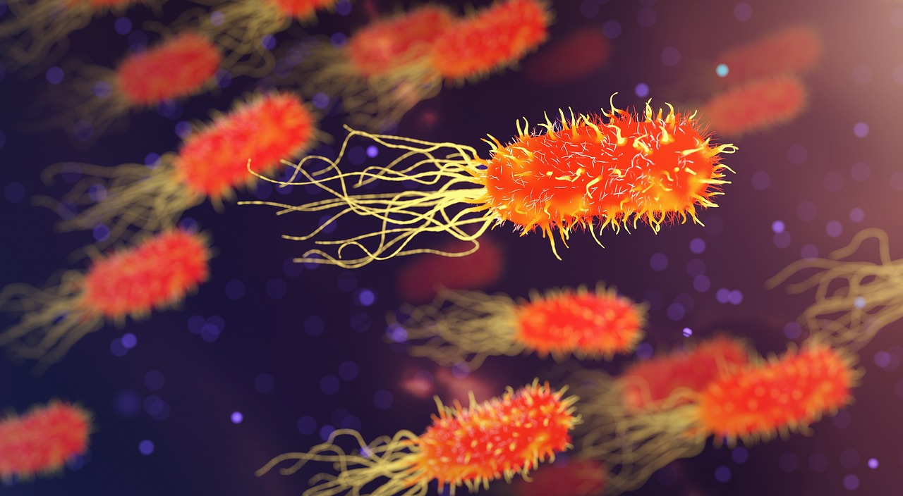

# Belly Button Biodiveristy

 

## Objective 

A visual dashboard made with poltly.js to depict the species and concetration of bacteria on the bellybutton of 200 samples. 

## Technologies 

- Python 3 
- Plotly.js 
- Flask 
- HTML/CSS

## Approach 

1.) Create and initialize a new [virtual enviornment](https://uoa-eresearch.github.io/eresearch-cookbook/recipe/2014/11/20/conda/) 

2.) Download install related technologies and dependencies 

- [Python 3](https://realpython.com/installing-python/) 

- [Ploty.js](https://plot.ly/javascript/getting-started/#download)  

- [d3.js] (https://www.tutorialspoint.com/d3js/d3js_installation.htm) 

- [Flask](https://flask.palletsprojects.com/en/1.1.x/installation/)  

3.) Clone [Repo](https://github.com/Yamahkarim/BellyButtonDashboard)  

4.) In the command line, navigate ot the cloned repo and run command: 

		`python app.py`  
		
5.) Open a web browser and navigate to the path: 

		`http://localhost:5000` 
		
6.) The page is an individual dashboard illustrating the carachetristics of each individual sample. 

- Change the sample under analysis through the dropdown menu on the left above the meta-data panel.  

- Both the pie chart and bubble chart depict the concentration of various bacteria per each sample (or person)
 